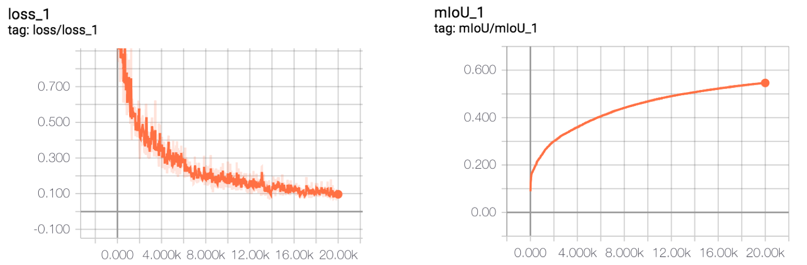

## About
A tensorflow implementation based on SegNet with a little change trained on CamVid dataset.

The CamVid dataset can be as follows:

```
|--CamVid
     |--train       (367)
          |--*.png
     |--trainannot  (367)
          |--*.png
     |--val         (101)
          |--*.png  
     |--valannot    (101)
          |--*.png
     |--test        (233)
          |--*.png
     |--testannot   (233)
          |--*.png
```

## To tfrecord

> python to_tfrecord.py

## Train

> python train.py

## Test

> python predict.py 

## Results

#### Before optimization

+ prediction on train set
    
    
    
+ prediction on test set

    

+ train loss and mIoU

    


#### After optimization